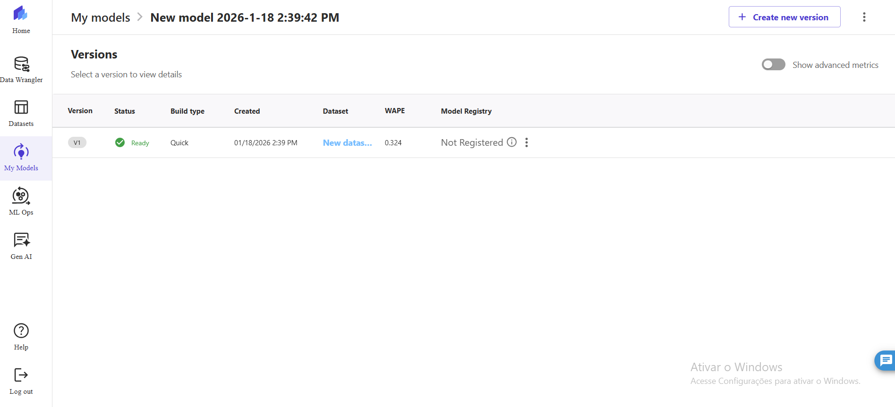
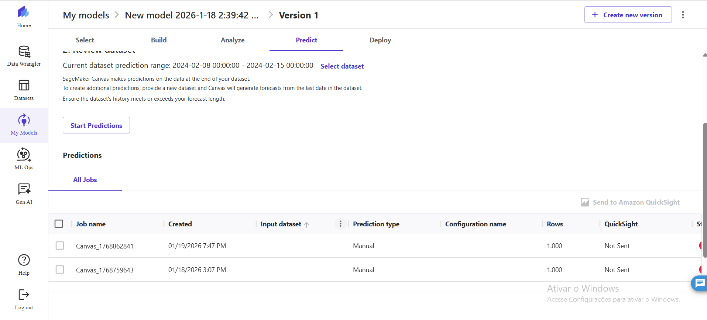
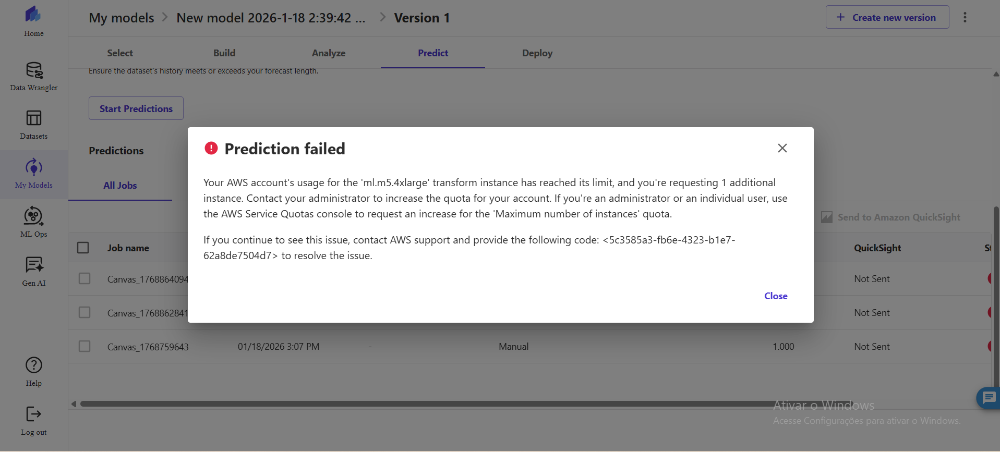

# Previsão de Estoque Inteligente na AWS com SageMaker Canvas

Este projeto foi desenvolvido como parte de um desafio educacional da DIO, utilizando o Amazon SageMaker Canvas para criação, treinamento e avaliação de um modelo de Machine Learning voltado à previsão de estoque.

## 1. Criação e Treinamento do Modelo
O dataset foi importado no SageMaker Canvas e utilizado para treinar um modelo de previsão de estoque.  
O treinamento foi concluído com sucesso, resultando no status **Ready**.

A principal métrica de avaliação utilizada foi o **WAPE**, cujo valor obtido foi **0.324**, indicando um desempenho satisfatório do modelo.

## 2. Tentativa de Inferência (Predição)
Após o treinamento, foi iniciada a etapa de **Batch Prediction**, conforme recomendado pelo SageMaker Canvas.

Os jobs de predição foram corretamente criados, conforme demonstrado abaixo:

## 3. Limitação de Quota da AWS
Durante a execução da inferência, a predição não pôde ser finalizada devido a uma limitação de quota da AWS relacionada ao uso da instância `ml.m5.4xlarge`.  
Esse tipo de limitação é comum em contas educacionais ou free tier.

A tentativa de execução e a mensagem de erro estão documentadas abaixo:

## Considerações Finais
Apesar da limitação de quota impedir a conclusão da inferência, todas as etapas principais do desafio foram corretamente executadas:
- Criação do modelo
- Treinamento bem-sucedido
- Geração de métricas
- Tentativa real de predição

O projeto reflete o uso prático do Amazon SageMaker Canvas em um contexto educacional.
